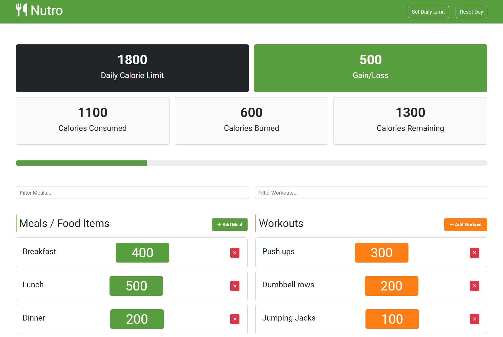

# Nutro

Nutro is a simple calorie counter app built with HTML, CSS, JavaScript, Bootstrap, and Webpack. It tracks your meals and workouts and calculates the total calories burned and consumed.

## Getting Started

To get started with Nutro, follow these steps:

1. Clone this repository to your local machine.
2. Run `npm install` to install the required dependencies.
3. Run `npm run dev` to start the web server. 
